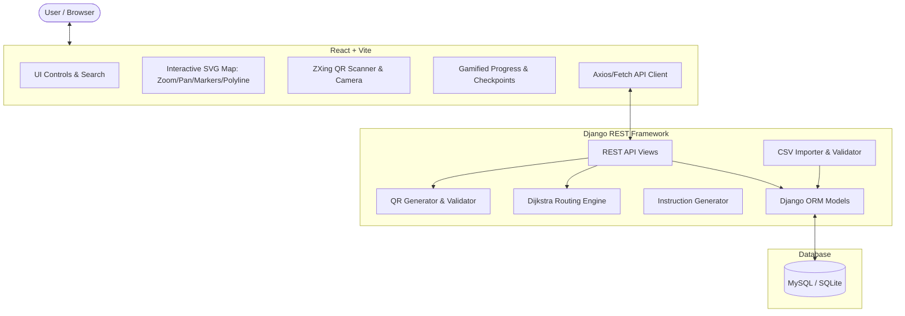

# NavixAI — Implementation Plan

NavixAI is a clean, modern, indoor navigation web application designed for campus buildings. The application allows users to scan QR codes for localized indoor positioning (or manually select a location), select destinations, calculate multi-floor shortest routes using Dijkstra's algorithm with lift vs. stairs preferences, visualize routes on an interactive indoor floor map inspired by Google Maps / Snazzy Maps minimalist design, and follow turn-by-turn instructions with a lightweight gamified checkpoint and progress tracking experience.

## User Review Required

> [!IMPORTANT]
> **Database Configuration**:
> The prompt specifies MySQL. We have installed `pymysql` and configured standard MySQL database settings via `.env`. For local development environments where a MySQL daemon may not be running or credentials are not yet configured, the system will automatically fall back to SQLite if MySQL connection fails or if `DB_ENGINE=sqlite` is specified in `.env`. This ensures zero-friction immediate testing while being 100% production-ready for MySQL.

> [!NOTE]
> **Synthetic Floor Data**:
> We have existing synthetic data in `floor data/synthetic data/synthetic data block 1.csv` covering 3 floors (35 nodes, including Entrances, Reception, Corridors, Junctions, Rooms, Labs, Offices, Restrooms, Lift A, and Staircase A). We will copy this to `data/building_nodes.csv` as the default test dataset and generate the comprehensive edge topology.

---

## Proposed Architecture & Milestones

### Component Architecture



---

## Milestones & Work Breakdown

### Milestone 1: Environment & Project Foundation
- Create `.env.example` and `.env` with backend configuration (Secret Key, DB credentials, walking speed, coordinate scale factor) and frontend configuration (`VITE_API_BASE_URL`).
- Setup Django backend in `backend/` with `manage.py`, `config/settings.py`, `config/urls.py`, CORS configuration, and REST framework.
- Setup React + Vite frontend in `frontend/` with Lucide React, `@zxing/browser`, and custom minimalist CSS design tokens.
- Copy and standardize `floor data/synthetic data/synthetic data block 1.csv` to `data/building_nodes.csv`.

### Milestone 2: Models & Database Migration
- Implement Django models in `backend/navigation/models.py`:
  - `Building`: `id`, `name`, `code`, `description`
  - `Floor`: `id`, `building` (FK), `floor_number`, `name`, `map_width`, `map_height`
  - `Node`: `id`, `node_id` (unique), `building` (FK), `block`, `name`, `type` (entrance, room, junction, corridor, stair, lift, amenity, office, lab, restroom), `floor` (FK), `x`, `y`, `qr_code`, `is_active`, `is_checkpoint`
  - `Edge`: `id`, `from_node` (FK), `to_node` (FK), `distance`, `accessible`, `movement_type` (walk, stairs, lift), `is_active`
  - `QRCode`: `id`, `node` (OneToOne), `payload`, `image_path`
- Implement Django Admin in `backend/navigation/admin.py` with search, filters, and list views.
- Execute migrations and verify database schema.

### Milestone 3: CSV Import Pipeline
- Implement `backend/navigation/importer/csv_parser.py` and `validator.py`:
  - Validates CSV headers, data types, coordinate bounds, duplicate `node_id`, duplicate `qr_code`, node types.
  - Automatically ensures Building and Floor entities exist.
  - Builds default connected graph edges for the building:
    - Intra-floor corridor and room connectivity based on block/junction topology.
    - Inter-floor connections connecting Staircase A (`F1_N09` ↔ `F2_N01` ↔ `F3_N01`) with `movement_type='stairs'`, and Lift A (`F1_N10` ↔ `F2_N02` ↔ `F3_N02`) with `movement_type='lift'`.
- Implement Django management command `python manage.py import_nodes data/building_nodes.csv` with detailed CLI feedback and idempotency.

### Milestone 4: Graph Construction & Dijkstra Routing Engine
- Implement `backend/navigation/routing/`:
  - `graph.py` / `graph_service.py`: Builds adjacency graph from DB Nodes and Edges with distance calculations.
  - `dijkstra.py`: Dijkstra shortest path algorithm supporting edge filtering (mode: `lift`, `stairs`, or `any`).
  - `route_engine.py`: Computes complete route, detects floor transitions, checks if both lift and stairs are available between source and destination floors.
  - `instruction_generator.py`: Generates human-readable turn-by-turn directions (e.g. "Start at Main Entrance", "Continue 15m to Main Junction", "Take Lift A to Floor 2", "Turn right into corridor", "Arrive at Lab 1 on your left").

### Milestone 5: QR Generation & Validation API
- Implement `backend/navigation/qr/`:
  - `generator.py`: Generates QR code images with `CAMPUSNAV:<node_id>` payloads and saves to `qr_codes/`.
  - Management command or service to generate QR codes for all imported nodes.
- Implement DRF Serializers and Views:
  - `GET /api/building/` & `GET /api/floors/`
  - `GET /api/nodes/` & `GET /api/nodes/<node_id>/`
  - `POST /api/scan/` (validates QR payload, returns node info or error)
  - `GET /api/routes/?from=...&to=...&mode=...` (calculates path, distance, ETA, instructions, checkpoints, lift/stair availability)
  - `GET /api/qr/<node_id>/` (serves QR code image)

### Milestone 6: Frontend Scanner Component
- Implement `frontend/src/components/Scanner.jsx` using `@zxing/browser`:
  - Video stream view finder with target reticle.
  - Handles camera permissions and device selection.
  - Fallback simulated QR selector / test scanner modal for instant desktop testing without physical webcam.
  - Auto-sends decoded QR payload to `POST /api/scan/` and triggers navigation source setting.

### Milestone 7: Search & Location Selection
- Implement `frontend/src/components/LocationSelector.jsx` and `DestinationSelector.jsx`:
  - Clean dropdowns with quick search filtering across names, types, and floors.
  - Quick-action buttons: "Use Scanned Location", "Swap Start & Destination", "Clear".
  - Category tags (e.g., Room, Lab, Lift, Stairs, Restroom).

### Milestone 8 & 9: Indoor Map & Snazzy/Google Maps Minimalist UI
- Implement `frontend/src/components/NavigationMap.jsx`:
  - Custom interactive SVG indoor floor map with zoom (+/- / mouse wheel) and pan (drag).
  - Clean Snazzy Maps minimalist aesthetic: muted architectural floor layout, corridor guides, room outlines.
  - Clear markers: Start pin (green pulse), Destination pin (red pin), Lift/Stairs indicators, corridor junctions.
  - Route polyline: smooth accented route line with animated dash flow indicating walking direction.
  - Multi-floor visualization: floor switcher (F1, F2, F3) showing the segment of the route relevant to the active floor, with badges indicating floor transition points.

### Milestone 10: Lift vs. Stairs Routing & Gamification
- Implement `frontend/src/components/LiftStairModal.jsx`:
  - Pops up when a multi-floor route offers both lift and stairs, letting user choose "Lift (Accessible)" or "Stairs (Active route)".
- Implement `frontend/src/components/ProgressCard.jsx` & `AchievementPanel.jsx`:
  - Progress tracker showing percentage completed, distance walked / remaining.
  - Interactive "Step Next Checkpoint" simulator to simulate walking through the route.
  - Achievement toasts (e.g., "+10 Navigation XP: Checkpoint reached", "🏆 Floor Transition Completed").
  - "Destination Reached 🎯" completion card with stats (distance walked, time taken, XP earned).

### Milestone 11: Polish, Testing, and Documentation
- Comprehensive automated backend unit and integration tests (`tests.py` covering CSV import, graph building, Dijkstra, lift vs stairs, QR scan, and route APIs).
- Production-grade `README.md` with complete architecture diagram, setup guide, API reference, and screenshots.

---

## Verification Plan

### Automated Tests
1. Run backend test suite:
   ```bash
   cd backend
   python manage.py test navigation
   ```
2. Verify CSV import CLI:
   ```bash
   python manage.py import_nodes ../data/building_nodes.csv
   ```
3. Verify QR code batch generator:
   ```bash
   python manage.py generate_qrcodes
   ```

### Manual Verification Flows
1. **API Endpoints**:
   - Verify `GET /api/nodes/` returns imported nodes.
   - Verify `POST /api/scan/` with `{"payload": "CAMPUSNAV:F1_N01"}` returns Main Entrance.
   - Verify `GET /api/routes/?from=F1_N01&to=F2_N08&mode=lift` returns shortest path traversing Lift A with floor transition.
   - Verify `GET /api/routes/?from=F1_N01&to=F2_N08&mode=stairs` returns shortest path traversing Staircase A.
2. **Frontend UI**:
   - Start frontend via `npm run dev` and backend via `python manage.py runserver`.
   - Test scanning / manual start selection: select "Main Entrance" (Floor 1).
   - Test destination selection: select "Lab 1" (Floor 2).
   - Verify Lift vs. Stairs modal triggers and recalculates route upon selection.
   - Verify floor switcher automatically highlights Floor 1 and lets user toggle to Floor 2 to view the second floor segment.
   - Test gamified checkpoint progress: click "Simulate Step" to advance along the checkpoints, verify XP badges, floor transition celebration, and destination reached modal.
